# OpenAvathar Licensing System Flow

This document describes the architectural flow for user purchasing, license activation, and verification using **Gumroad** and **Cloudflare Workers (KV)**.

## 1. System Flowchart

```mermaid
flowchart TD
    %% Phase 1: Purchase
    subgraph "Phase 1: Purchase & Auto-Registration"
    A[User Buys Pro on Gumroad] --> B[Gumroad Sends Webhook 'Ping']
    B --> C{Worker: Verify Sig?}
    C -- "Using GUMROAD_SECRET" --> D[Store License Info in LICENSES_KV]
    style D fill:#d4edda,stroke:#28a745
    end

    %% Phase 2: Activation
    subgraph "Phase 2: User Activation (One-time)"
    E[User enters Key in App] --> F[App calls /api/license/activate]
    F --> G{Key in KV?}
    G -- Yes --> H[Add Device Fingerprint to KV Record]
    G -- No --> I[Attempt Gumroad API Sync]
    I --> H
    H --> J[Return Success to App]
    style J fill:#fff3cd,stroke:#ffc107
    end

    %% Phase 3: Usage
    subgraph "Phase 3: Periodic Validation & Usage"
    K[User Clicks 'Generate'] --> L[Worker calls resolveLicense]
    L --> M{Check KV First}
    M -- Found --> N[Verify Fingerprint Match]
    M -- Not Found --> O[Fallback: Call Gumroad API]
    O -- Valid --> P[Sync into KV & Approve]
    N -- Valid --> Q[ALLOW: Unlimited Generations]
    N -- Invalid/Free --> R[RESTRICT: Daily Limit Check]
    style Q fill:#cce5ff,stroke:#004085
    style R fill:#f8d7da,stroke:#721c24
    end
```

---

## 2. Detailed Phase Breakdown

### Phase 1: Purchase & Webhook
When a user buys the product, Gumroad fires a webhook to `/api/gumroad/webhook`.
- **Security**: The worker uses `GUMROAD_SECRET` to verify the `X-Gumroad-Signature` header (HMAC-SHA256).
- **Data**: The worker parses the sale data (license key, email, product) and creates a record in `LICENSES_KV`.

### Phase 2: Activation (Linking Device)
The user enters their license key in the UI. 
- **Fingerprinting**: The app sends a unique browser/device fingerprint.
- **Record Update**: The worker finds the license key and adds the fingerprint to the `activations` array.
- **Max Activations**: By default, we allow **3 activations** per license.

### Phase 3: Validation (Generation Guard)
Every generation request checks the license status via `resolveLicense()`.
- **KV-First Strategy**: We always check our local database (Cloudflare KV) first for speed.
- **Sync Fallback**: If the key isn't in KV (e.g., webhook failed), we call Gumroad's `/v2/licenses/verify` API and then sync the result back to KV for future requests.

---

## 3. Required Secrets & Config

| Key                  | Purpose                        | Source                                     |
| :------------------- | :----------------------------- | :----------------------------------------- |
| `GUMROAD_SECRET`     | Webhook signature verification | Gumroad Settings > Developers > App Secret |
| `GUMROAD_PRODUCT_ID` | API validation fallback        | Gumroad Product ID (Short URL segment)     |
| `VITE_GUMROAD_URL`   | Frontend checkout link         | Gumroad Product Permalink                  |

## 4. Testing the Flow

Refer to `projects/GUMROAD_TESTING.md` for steps on how to simulate webhooks and manual key verification without completing real payments.
